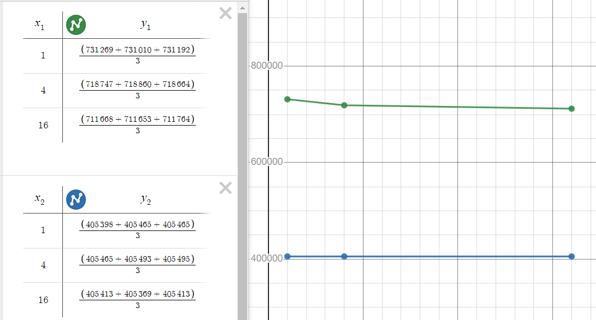

# 701 Assignment 1
## Beck Busch - bbus692 - 975040349

# Task 2

## b)
| N=10 | Addition | Subtraction | Multiplication |
|------|----------|-------------|----------------|
| Attempt 1 | 80859 | 81154 | 1021059 |
| Attempt 2 | 80924 | 80918 | 1021107 |
| Attempt 3 | 80858 | 80986 | 1021168 |

## c)
The steps to run a storage test are as follows:  
Change cpu settings > Generate .qip > Compile > Program > Generate BSP > Build and Run  
Here is an example of the terminal output during a test:

```
This application performs NxN matrix operations  
N is 10, the operation is Multiplication  
*array output*  
timestamp_start_time = 115 ticks
timestamp_end_time = 94366 ticks

timestamp measurement = 94251 ticks
timestamp measurement overhead = 106 ticks
Actual time  = 94145 ticks
Timestamp timer frequency = 50000000
This program is now complete
```

After running many different tests I got these results:

### Matrix Multiplication Function with varying Cache sizes
| Configuration | Attempt 1 | Attempt 2 | Attempt 3 |
|---------------|-----------|-----------|-----------|
| 1Kb Data, 0Kb Inst | 731269 | 731010 | 731192 |
| 4Kb Data, 0Kb Inst | 718747 | 718860 | 718664 |
| 16Kb Data, 0Kb Inst | 711668 | 711653 | 711764 |
| 0Kb Data, 1Kb Inst | 405398 | 405465 | 405465 |
| 0Kb Data, 4Kb Inst | 405465 | 405493 | 405495 |
| 0Kb Data, 16Kb Inst | 405413 | 405369 | 405413 |
| **16Kb Data, 1Kb Inst** | **94079** | **94026** | **94145** |

From these results we can tell that increasing the Data cache has a decent impact on processing speed, tapering off after about 4Kb. Instruction cache on the other hand has a massive effect when 1Kb is used, but this effect does not increase with more memory. Therefore I have determined the optimum space usage to be **16Kb of Data Cache and 1Kb of Instruction Cache**.



## d)
### Custom Instruction Usage
My custom instruction takes 4 16 bit numbers as 2 32 bit inputs. It preforms two multiplication operations, then adds the products together. This result is returned as a 32 bit number. What this instruction is doing is preforming two multiplication operations in one instruction, essentially halving the time spent on multiplication.

This result isn't as good as it could be, since I have to waste computational power casting the inputs to a 32 bit pointer. This is because my code does not pull two values at once from the array, and has to manually 'assemble' them.

| Instruction | Attempt 1 | Attempt 2 | Attempt 3 | Average |
|-------------|-----------|-----------|-----------|---------|
| Custom Instruction | 569814 | 569725 | 569809 | 569783 |
| Regular Code | 980258 | 980217 | 980277 | 980251 |

From these results we can see that using the custom instruction results in a 40% speed increase.

### Result with Custom Instruction
```
This application performs NxN matrix operations
N is 10, the operation is Multiplication
986, 1470, 1604, 1067, 660, 1825, 1160, 1656, 1783, 966, 
807, 1156, 1079, 699, 471, 1281, 908, 986, 1508, 934, 
1020, 1499, 1478, 987, 712, 1718, 1109, 1570, 1966, 1170, 
1042, 1158, 1062, 704, 473, 1349, 955, 1125, 1584, 880, 
1052, 918, 962, 722, 643, 1368, 1096, 1119, 1356, 769, 
758, 1035, 1015, 841, 547, 1230, 980, 967, 1251, 770, 
957, 893, 911, 805, 711, 1194, 832, 1023, 1008, 734, 
709, 1166, 969, 745, 456, 1244, 922, 1090, 1528, 894, 
821, 1119, 1075, 855, 777, 1400, 1005, 932, 1310, 879, 
844, 975, 973, 612, 637, 1348, 850, 954, 1271, 720, 

timestamp_start_time = 385 ticks
timestamp_end_time = 570872 ticks

timestamp measurement = 570487 ticks
timestamp measurement overhead = 673 ticks
Actual time  = 569814 ticks
Timestamp timer frequency = 50000000
This program is now complete
```
### Result without custom instruction:
```
This application performs NxN matrix operations
N is 10, the operation is Multiplication
986, 1470, 1604, 1067, 660, 1825, 1160, 1656, 1783, 966, 
807, 1156, 1079, 699, 471, 1281, 908, 986, 1508, 934, 
1020, 1499, 1478, 987, 712, 1718, 1109, 1570, 1966, 1170, 
1042, 1158, 1062, 704, 473, 1349, 955, 1125, 1584, 880, 
1052, 918, 962, 722, 643, 1368, 1096, 1119, 1356, 769, 
758, 1035, 1015, 841, 547, 1230, 980, 967, 1251, 770, 
957, 893, 911, 805, 711, 1194, 832, 1023, 1008, 734, 
709, 1166, 969, 745, 456, 1244, 922, 1090, 1528, 894, 
821, 1119, 1075, 855, 777, 1400, 1005, 932, 1310, 879, 
844, 975, 973, 612, 637, 1348, 850, 954, 1271, 720, 

timestamp_start_time = 401 ticks
timestamp_end_time = 981407 ticks

timestamp measurement = 981006 ticks
timestamp measurement overhead = 681 ticks
Actual time  = 980325 ticks
Timestamp timer frequency = 50000000
This program is now complete
```

## Footnotes
#### Test Matrices:
```
Matrix A
6 18 1 13 20 17 15 12 17 5
2 3 13 8 2 11 11 16 15 8
2 13 15 17 17 12 12 19 16 0
4 2 10 5 6 3 13 20, 13 18
8 14 18 3 10 15 9 9 2 11
12 3 9 4 3 20 11 12 5 9
19 15 16 2 3 13 6 15 2 0
1 3 11 15 7 16 6 12 10 8
17 7 19 5 0 16 12 9 13 0
8 12 14 6 7 3 12 5 18 4

Matrix B
10 10 3 15 16 13 7 10 0 0
17 2 9 4 6 15 3 17 1 4
14 5 1 0 12 12 15 2 19 12
0 19 1 15 10 13 1 20 20 14
8 8 13 5 4 13 14 17 18 0
1 14 18 12 1 14 18 9 15 10
2 9 20 15 13 18 9 9 15 11
15 17 18 11 0 9 4 18 18 16
7 20 19 2 1 20 11 7 20 9
20 9 1 3 1 16 16 13 18 4
```
#### Proper output of matrix multiplication
```
986	1470 1604 1067 660 1825 1160 1656 1783 966
807	1156 1079 699 471 1281 908 986 1508 934
1020 1499 1478 987 712 1718	1109 1570 1966 1170
1042 1158 1062 704 473 1349	955	1125 1584 880
1052 918 962 722 643 1368 1096 1119 1356 769
758	1035 1015 841 547 1230 980 967 1251 770
957	893	911	805	711	1194 832 1023 1008 734
709	1166 969 745 456 1244 922 1090 1528 894
821	1119 1075 855 777 1400 1005	932	1310 879
844	975	973	612	637	1348 850 954 1271 720
```

